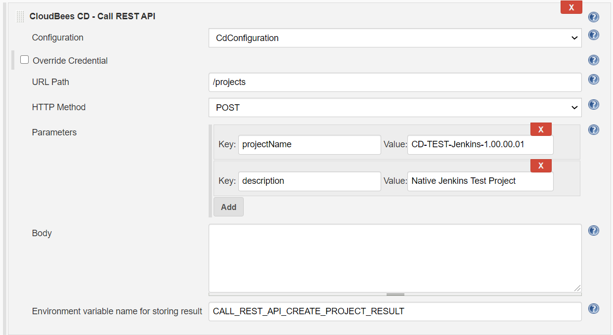
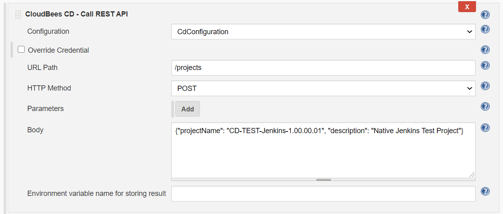
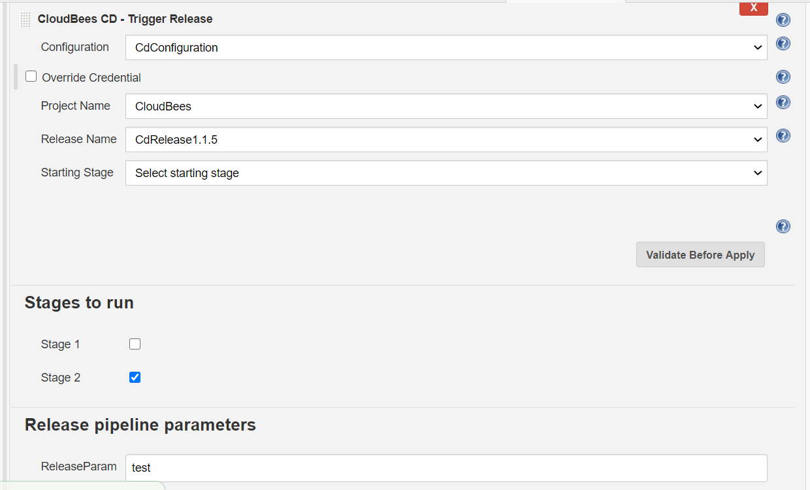
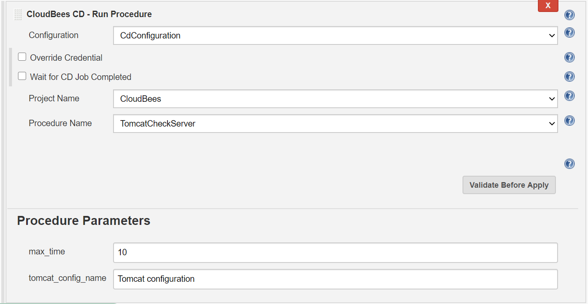

# CloudBees Flow
CloudBees Flow Application Release Orchestration.

# Overview

CloudBees Flow is an enterprise-grade DevOps Release Automation platform
that simplifies provisioning, build and release of multi-tiered
applications. Our model-driven approach to managing environments and
applications allows teams to collaborate on and coordinate multiple
pipelines and releases across hybrid infrastructure in an efficient,
predictable and auditable way. 

# Features

With the CloudBees Flow plugin you can:

-   Trigger a release in CloudBees Flow
-   Trigger a pipeline in CloudBees Flow
-   Deploy an application in CloudBees Flow
-   Publish an artifact from Jenkins into the CloudBees Flow artifact
    repository
-   Run a Procedure in CloudBees Flow
-   Call a REST API to invoke any action in CloudBees Flow
-   Create Application in CloudBees Flow from Deployment Package

# Connection Configurations

In order to use and integrate with CloudBees Flow, you would have to
create a connection configuration in Jenkins, that stores connection
information of the CloudBees Flow Server you are connecting to. You can
create one or more connection configurations depending on the number of
Servers or Environments you are integrating with.

Navigate to Manage Jenkins / Configure System and go to CloudBees Flow
section. One or more configurations can be created to connect to and
call APIs into CloudBees Flow system. For each configuration, the
following attributes need to be specified:

-   Configuration Name: Specify the name to store this configuration,
    which is used to connect to the CloudBees Flow Server.

-   Server URL: CloudBees Flow Server URL

-   REST API Version: CloudBees Flow Server Rest API Version

-   User Name: CloudBees Flow user name for Connection

-   User Password: CloudBees Flow password for Connection

-   Override CloudBees Flow SSL Validation Check: By default SSL
    Validation Check will be performed. Choose this setting to override
    the check. If you do not want to override this check, perform the
    SSL certificate setup required in Jenkins and CloudBees Flow as per
    the CloudBees Flow Server documentation.


# Supported Post Build Actions

Following post build actions are available in CloudBees Flow
Plugin. These actions can be executed separately or combined
sequentially.

## Create Application from Deployment Package to CloudBees Flow

This integration allows you to create and deploy Java, .NET or any other
application to any environment in CloudBees Flow. Deployment package
would be generated as part of your Jenkins CI build, and contain a
Manifest file and artifacts to be deployed. 

Sample manifest.json file can be found
at [https://github.com/electric-cloud/DeploymentPackageManager/tree/master/SampleManifests](https://github.com/electric-cloud/DeploymentPackageManager/tree/master/SampleManifests). 

This build action has following parameters:

-   Configuration: Name of the CloudBees Flow configuration

-   Deployment Package Path: Location or path for the deployment package
    to be published to CloudBees Flow. For e.g., MyProject/target


Note: pipelines are not supported for this post build action in this
version of plugin.

## Publish Artifact to CloudBees Flow

This integration allows you to publish the artifact for your application
to CloudBees Flow. The Artifact will be generated as part of your
Jenkins CI build. 

This build action takes the following parameters:

-   Configuration: Name of the CloudBees Flow configuration

-   Artifact Path: Location or path for the artifact files to be
    published to CloudBees Flow. For
    e.g., MyProject/\*\*/\*-$BUILD\_NUMBER.war

-   Artifact Name: Name of the application artifact using the format
    \<group\_id\>:\<artifact\_key\>. For e.g., "com.example:helloworld"

-   Artifact Version: Version of the application artifact. For e.g., you
    can specify 1.0 or 1.0-$BUILD\_TAG that is based on Jenkins
    environment variable

-   CloudBees Flow Repository Name: Name of the CloudBees Flow
    Repository


Note: pipelines are not supported for this post build action in this
version of plugin.

## Run Pipeline in CloudBees Flow

This integration allows you to run a pipeline in CloudBees Flow.

This build action takes the following parameters:

- Configuration: Name of the CloudBees Flow configuration

- Project Name: Name of the CloudBees Flow project

- Pipeline Name: Name of the CloudBees Flow pipeline

- (Optional) Pipeline Parameters

  -   Parameter name will be displayed as Label

  -   Parameter value to be specified will be displayed as text input
    field


**Run Pipeline Example (Pipeline Script)**

``` syntaxhighlighter-pre
node{
        step([$class: 'ElectricFlowPipelinePublisher', 
            configuration: 'CBFConfiguration',
            projectName: 'CloudBees',
            pipelineName: 'CBFPipeline',
            addParam: '{"pipeline":{"pipelineName":"CBFPipeline","parameters":"[{\\\"parameterName\\\": \\\"PipelineParam\\\", \\\"parameterValue\\\": \\\"185\\\"}]"}}'
    ])
}
```

## Call REST API of CloudBees Flow

This integration allows you to call the CloudBees Flow REST API. Similar
workflow step is available.

This build action takes the following parameters:

-   Configuration: Specify the name of the CloudBees Flow configuration.

-   URL Path: Specify the URL Path for the REST API

-   HTTP Method: Specify the HTTP Method

-   Parameters: Specify the parameters for the REST API. Parameters are
    transformed into JSON object and used within body of HTTP request.

-   Body: Specify the body for the REST API. This parameter is not used
    if 'Parameters' are provided.

-   Environment variable name for storing result: If provided, result of
    calling CloudBees REST API (JSON output) will be stored within
    provided environment variable available within build.



**Call REST API Example \#1 (Pipeline Script)**

``` syntaxhighlighter-pre
node{
        step([$class: 'ElectricFlowGenericRestApi', 
            configuration: 'CBFConfiguration',
            urlPath : '/projects',
            httpMethod : 'POST',
            body : '',
            parameters : [
                [$class: 'Pair', 
                    key: 'projectName',
                    value: 'EC-TEST-Jenkins-1.00.00.01'
                ],
                [$class: 'Pair', 
                    key: 'description',
                    value: 'Native Jenkins Test Project'
                ]
            ],
            envVarNameForResult: 'CALL_REST_API_CREATE_PROJECT_RESULT'
    ])
}
```



**Call REST API Example \#2 (Pipeline Script)**

``` syntaxhighlighter-pre
node{
        step([$class: 'ElectricFlowGenericRestApi', 
            configuration: 'CBFConfiguration',
            urlPath : '/projects',
            httpMethod : 'POST',
            body : '{"projectName": "EC-TEST-Jenkins-1.00.00.01", "description": "Native Jenkins Test Project"}'
    ])
}
```

## Deploy Application using CloudBees Flow

This integration allows you to deploy an application using CloudBees
Flow.

This build action takes the following parameters:

- Configuration: Specify the name of the CloudBees Flow configuration

- Project Name: Specify the CloudBees Flow project name

- Application Name: Specify the CloudBees Flow application name

- Application Process Name: Specify the CloudBees Flow application process
name

- Environment Name: Specify the CloudBees Flow environment name

- (Optional) Deploy Parameters

  -   Parameter name will be displayed as Label

  -   Parameter value to be specified will be displayed as text input
    field


**Deploy Application Example (Pipeline Script)**

``` syntaxhighlighter-pre
node{
        step([$class: 'ElectricFlowDeployApplication', 
            configuration: 'CBFConfiguration',
            projectName : 'CloudBees',
            applicationName : 'DemoApplication',
            applicationProcessName : 'RunCommand',
            environmentName : 'CBFEnvironment',
            deployParameters : '{"runProcess":{"applicationName":"DemoApplication","applicationProcessName":"RunCommand","parameter":"[{\\\"actualParameterName\\\": \\\"Parameter1\\\", \\\"value\\\": \\\"value1\\\"}, {\\\"actualParameterName\\\": \\\"Parameter2\\\", \\\"value\\\": \\\"value2\\\"}]"}}'
    ])
}
```

## Trigger Release in CloudBees Flow

This Integration allows you to trigger a release in CloudBees Flow.

This build action has following parameters:

- Configuration: Specify the name of the CloudBees Flow configuration

- Project Name: Specify the CloudBees Flow project name

- Release Name: Specify the CloudBees Flow release name

- (Optional) Starting Stage: Specify starting stage to run in the
CloudBees Flow pipeline

  -   Parameter is required if ‘Stages to run’ isn’t used

- (Optional) Stages to run: Specify stages to run in the CloudBees Flow
pipeline

  -   Parameter is required if ‘Starting Stage’ isn’t used

- (Optional) Pipeline parameters: Specify parameters for the CloudBees
Flow pipeline

  -   Parameter name will be displayed as Label

  -   Parameter value to be specified should go in the text input field



**Trigger Release Example (Pipeline Script)**

``` syntaxhighlighter-pre
node{
        step([$class: 'ElectricFlowTriggerRelease', 
            configuration: 'CBFConfiguration',
            projectName : 'CloudBees',
            releaseName : 'CBFRelease1.1.5',
            startingStage : '',
            parameters : '{"release":{"releaseName":"CBFRelease1.1.5","stages":"[{\\\"stageName\\\": \\\"Stage 1\\\", \\\"stageValue\\\": false}, {\\\"stageName\\\": \\\"Stage 2\\\", \\\"stageValue\\\": true}]","parameters":"[{\\\"parameterName\\\": \\\"ReleaseParam\\\", \\\"parameterValue\\\": \\\"parameter\\\"}]"}}'
    ])
}
```

## Run Procedure in CloudBees Flow

This Integration allows you run a procedure in CloudBees Flow.

This build action has following parameters:

- Configuration: Specify the name of the CloudBees Flow configuration

- Project Name: Specify the CloudBees Flow project name

- Procedure Name: Specify the CloudBees Flow procedure name

- (Optional) Procedure Parameters

  -   Parameter name will be displayed as Label

  -   Parameter value to be specified should go in the text input field



**Run Procedure Example (Pipeline Script)**

``` syntaxhighlighter-pre
node{
        step([$class: 'ElectricFlowRunProcedure', 
            configuration: 'CBFConfiguration',
            projectName : 'CloudBees',
            procedureName : 'TomcatCheckServer',
            procedureParameters : '{"procedure":{"procedureName":"TomcatCheckServer","parameters":"[{\\\"actualParameterName\\\": \\\"max_time\\\", \\\"value\\\": \\\"10\\\"}, {\\\"actualParameterName\\\": \\\"tomcat_config_name\\\", \\\"value\\\": \\\"EC-Tomcat config\\\"}]"}}'
    ])
}
```

# Supported Workflow Steps

Following workflow steps are available in CloudBees Flow Plugin.

## Call REST API of CloudBees Flow

This integration allows you to call the CloudBees Flow REST API. Similar
post build action is
available.

Function name: cloudBeesFlowCallRestApi

This workflow step takes the following parameters:

-   Configuration: Specify the name of the CloudBees Flow configuration.

-   URL Path: Specify the URL Path for the REST API

-   HTTP Method: Specify the HTTP Method

-   Parameters: Specify the parameters for the REST API. Parameters are
    transformed into JSON object and used within body of HTTP request.

-   Body: Specify the body for the REST API. This parameter is not used
    if 'Parameters' are provided.

-   Environment variable name for storing result: If provided, result of
    calling CloudBees REST API (JSON output) will be stored within
    provided environment variable available within build.


  

**Call REST API Example Workflow Step \#1 (Scripted Pipeline)**

``` syntaxhighlighter-pre
node{
    stage('Test') {
        def result = cloudBeesFlowCallRestApi body: '', configuration: 'CBFConfiguration', envVarNameForResult: 'CALL_REST_API_CREATE_PROJECT_RESULT', httpMethod: 'POST', parameters: [[key: 'projectName', value: 'EC-TEST-Jenkins-1.00.00.01'], [key: 'description', value: 'Native Jenkins Test Project']], urlPath: '/projects'
        echo "result : $result"
        echo "CALL_REST_API_CREATE_PROJECT_RESULT environment variable: $CALL_REST_API_CREATE_PROJECT_RESULT"
    }
}
```

**Call REST API Example Workflow Step \#2 (Declarative Pipeline)**

``` syntaxhighlighter-pre
pipeline{
    agent none
    stages {
        stage('Example Build') {
            steps {
                cloudBeesFlowCallRestApi body: '', configuration: 'CBFConfiguration', envVarNameForResult: 'CALL_REST_API_CREATE_PROJECT_RESULT', httpMethod: 'POST', parameters: [[key: 'projectName', value: 'EC-TEST-Jenkins-1.00.00.01'], [key: 'description', value: 'Native Jenkins Test Project']], urlPath: '/projects'
            }
        }
        stage('Example Build 2') {
            steps {
                echo "CALL_REST_API_CREATE_PROJECT_RESULT environment variable: $CALL_REST_API_CREATE_PROJECT_RESULT"
            }
        }
    }
}
```

# Release Notes

## Version 1.1.10 (Sep 26, 2019)

Updated "CloudBees Flow - Call REST API" related functionality:

-   Added support of the new workflow step "CloudBees Flow - Call REST
    API" which is based on the same functionality as corresponded post
    build action. Snippet generator UI is available for the new workflow
    step
-   Result of calling CloudBees Flow REST API (JSON output) now can be
    stored within environment variable available within build and also
    can be returned by the new workflow step within scripted pipelines
-   Fixed URL on summary page of Call REST API jobs

Changed Jenkins baseline version for the plugin to 2.138.4

## Version 1.1.9 (Jun 12, 2019)

-   Added basic unit tests

## Version 1.1.8 (Jun 12, 2019)

-   Re-branding: renaming from "Electric Flow" to "CloudBees Flow"

## Version 1.1.7 (Jun 11, 2019)

-   [Fix security
    issue](https://jenkins.io/security/advisory/2019-06-11/)
    (SECURITY-1420)

## Version 1.1.6 (Jun 11, 2019)

-   [Fix security
    issues](https://jenkins.io/security/advisory/2019-06-11/)
    (SECURITY-1410, SECURITY-1411, SECURITY-1412)

## Version 1.1.5 (Dec 19, 2018)

Support for the following New Post Build Actions have been added:

-   ElectricFlow - Deploy Application
-   ElectricFlow - Trigger Release
-   ElectricFlow - Call REST API
-   ElectricFlow - Run Procedure

Post Build Action "ElectricFlow - Run Pipeline" modified as follows:

-   It can now be run for pipelines without parameters

Post Build Action "ElectricFlow - Publish Artifact" modified as follows:

-   Added support for publishing to both directories and sub-directories
-   Explicit error messages added for build runs

Usability Changes

-   Post Build Action page shows dynamically retrieved values all the
    time
-   Two new buttons "Validate Before Apply" and "Compare Before Apply"
    added in Post Build Action Pages for Deploy Application, Trigger
    Release, Run Procedure and Run Pipeline, to make sure that failure
    to retrieve information is handled gracefully (no stack traces) and
    at the same time, users can understand the field errors before
    saving the configuration.
-   More descriptive Help tips.
-   More verbose messages when Test Connection fails with Electric Flow.
-   More verbose logging on response body for failed Rest API calls.
-   New option called "Override Electric Flow SSL Validation Check"
    introduced for testing connection with Electric Flow, where there is
    a need to test Electric Flow Post Build Actions before doing the SSL
    setup.

## Version 1.1.4 (Nov 22, 2017)

Post Build Action "ElectricFlow - Publish Artifact" modified as follows:

-   Fixed Scenarios where Build Step fails with exceptions
-   Added Support for remoting (build on remote windows machines)

## Version 1.1.3 (May 9, 2017)

Support added for running plugin tasks from jenkins pipeline as per
<https://issues.jenkins-ci.org/browse/JENKINS-44084>.

## Version 1.1.2 (Apr 28, 2017)

More detailed output from plugin on build page results.  
Hierarchy files output added to build page.

## Version 1.1.1 (Apr 27, 2017)

General clean up of code.

## Version 1.0 (Apr 26, 2017)

Initial Release.
